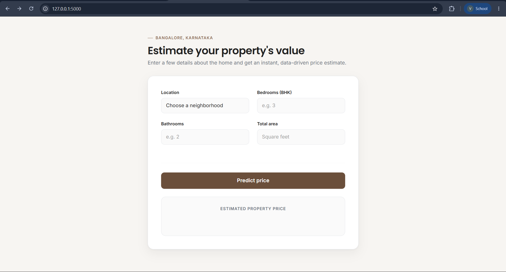
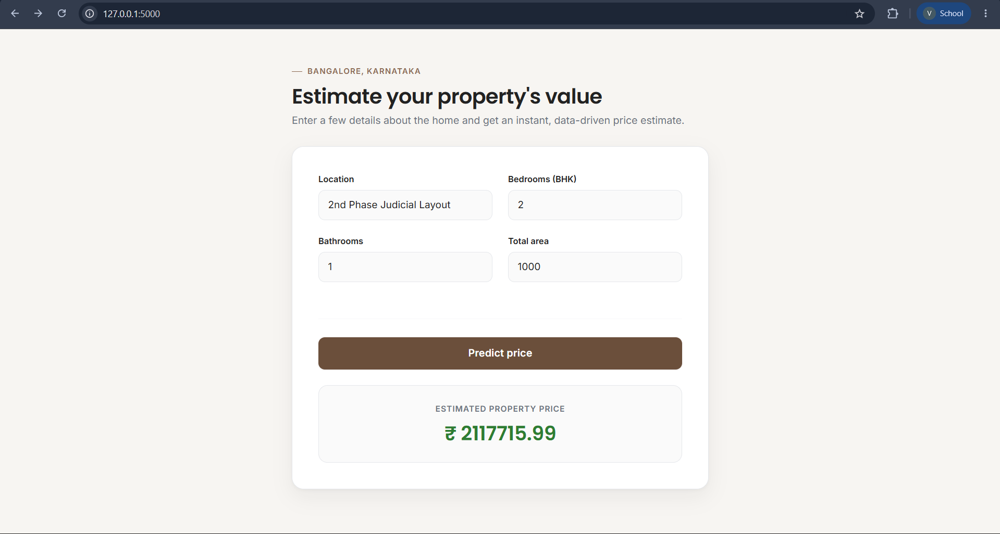
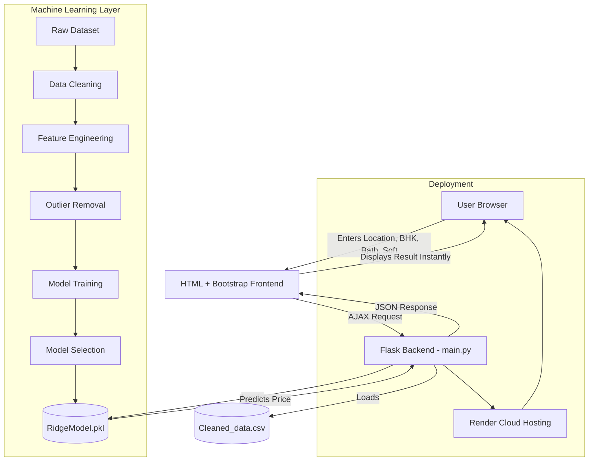

<div align="center">

# 🏡 Bangalore House Price Prediction


<br/>


<br/>

[](https://www.python.org/)
[](https://flask.palletsprojects.com/)
[](https://scikit-learn.org/)
[](LICENSE)
[](https://bangalore-house-price-kio0.onrender.com/)

[](https://github.com/vikashkumarsingh21/Bangalore-House-Price/stargazers)
[](https://github.com/vikashkumarsingh21/Bangalore-House-Price/network/members)
[](https://github.com/vikashkumarsingh21/Bangalore-House-Price/issues)
[](https://github.com/vikashkumarsingh21/Bangalore-House-Price/commits/main)

### 🔗 [Live Demo](https://bangalore-house-price-kio0.onrender.com/) &nbsp;|&nbsp; 📂 [GitHub Repository](https://github.com/vikashkumarsingh21/Bangalore-House-Price)

</div>

---

## 📌 Table of Contents

- [About the Project](#-about-the-project)
- [Live Demo](#-live-demo)
- [Screenshots](#-screenshots)
- [Features](#-features)
- [Machine Learning Pipeline](#-machine-learning-pipeline)
- [Project Architecture](#-project-architecture)
- [Project Structure](#-project-structure)
- [Tech Stack](#-tech-stack)
- [Installation Guide](#-installation-guide)
- [Git Commands Reference](#-git-commands-reference)
- [Deployment](#-deployment)
- [Future Improvements](#-future-improvements)
- [Contributing](#-contributing)
- [License](#-license)
- [Support](#-support)
- [Author](#-author)
- [Acknowledgements](#-acknowledgements)

---

## 📖 About the Project

**Bangalore House Price Prediction** is an end-to-end Machine Learning web application that predicts real estate prices in Bangalore based on key property attributes.

Users simply provide:

| Input | Description |
|-------|-------------|
| 📍 **Location** | Locality within Bangalore |
| 🛏️ **BHK** | Number of bedrooms |
| 🛁 **Bathrooms** | Number of bathrooms |
| 📐 **Total Area** | Total square footage of the property |

...and the trained **Ridge Regression** model returns an instant, data-driven price estimate — no page reload required, thanks to AJAX-powered predictions.

This project demonstrates the **complete ML lifecycle**: from raw, messy real-estate data to a cleaned dataset, engineered features, trained and evaluated models, and a fully deployed production web app.

---

## 🚀 Live Demo

🔗 **Try it here:** [bangalore-house-price-kio0.onrender.com](https://bangalore-house-price-kio0.onrender.com/)

> ⚡ Note: The app is hosted on Render's free tier, so the first request after inactivity may take a few seconds to spin up.

---

## 🖼️ Screenshots

<div align="center">

### 🏠 Home Page


### 📊 Prediction Result


### 📱 Mobile Responsive View


</div>

---

## ✨ Features

- 🔮 **Instant Price Prediction** — get real-time results without refreshing the page
- 🧹 **Robust Data Cleaning Pipeline** — handles missing values, outliers, and messy categorical data
- 🧠 **Multiple ML Models Compared** — Linear, Lasso, and Ridge Regression evaluated for best accuracy
- 🌐 **AJAX-Powered Frontend** — smooth, modern user experience with no page reloads
- 📱 **Fully Responsive UI** — built with Bootstrap for mobile, tablet, and desktop
- ☁️ **Live Cloud Deployment** — hosted and accessible from anywhere via Render
- 🔓 **Open Source** — clean, well-documented, and easy to extend

---

## 🧠 Machine Learning Pipeline

The dataset goes through a rigorous, multi-stage pipeline before the model is trained and deployed:

```
Dataset Loading
      ↓
Data Cleaning
      ↓
Missing Value Handling
      ↓
Feature Engineering
      ↓
Converting Size into BHK
      ↓
Converting Total Square Feet
      ↓
Location Cleaning
      ↓
Handling Rare Locations
      ↓
Removing Outliers
      ↓
Model Training
      ↓
Model Evaluation
      ↓
Selecting Best Model
      ↓
Saving Model with Pickle
      ↓
Flask Integration
      ↓
Frontend Integration
      ↓
Deployment
```

### 🧹 Data Preprocessing Details

| Step | Description |
|------|-------------|
| **Removing unnecessary columns** | Dropped columns like `society`, `availability`, and `area_type` that added noise without predictive value |
| **Handling null values** | Rows with missing critical fields (location, size, bath) were dropped or imputed sensibly |
| **Cleaning location names** | Trimmed whitespace and standardized inconsistent location naming |
| **Converting `total_sqft` ranges** | Ranges like `"2100 - 2850"` were converted into their numeric average |
| **Feature engineering** | Created a `price_per_sqft` feature to help detect and remove outliers |
| **Removing outliers** | Removed properties with unusually low sqft-per-bedroom ratios and extreme price-per-sqft values using statistical thresholds (mean ± standard deviation per location) |
| **Location grouping** | Locations appearing fewer than 10 times were grouped into an `"other"` category to reduce dimensionality |

### 🤖 Models Trained

Three regression models were trained and evaluated using cross-validation:

| Model | Purpose |
|-------|---------|
| **Linear Regression** | Baseline model for comparison |
| **Lasso Regression** | Tested with L1 regularization to reduce overfitting |
| **Ridge Regression** | Tested with L2 regularization for better generalization |

**✅ Ridge Regression was selected as the final model** because it consistently delivered the best cross-validated accuracy while handling multicollinearity among the one-hot encoded location features more gracefully than plain Linear Regression, and generalized better than Lasso on this dataset's feature distribution.

The final model is serialized using **Pickle** (`RidgeModel.pkl`) for fast loading during inference in the Flask app.

---

## 🏗️ Project Architecture



---

## 📁 Project Structure

```
Bangalore-House-Price/
│
├── templates/              # HTML templates for the Flask app
│   └── index.html
│
├── assets/                 # static assets
│   
│
├── main.py                 # Flask application entry point
├── Predictor.ipynb         # Jupyter notebook with full ML workflow
├── Cleaned_data.csv        # Preprocessed dataset used for training
├── RidgeModel.pkl          # Serialized trained Ridge Regression model
├── requirements.txt        # Python dependencies
└── README.md                # Project documentation
```

---

## 🛠️ Tech Stack

<div align="center">

| Category | Technologies |
|----------|--------------|
| **Language** |  |
| **Backend** |  |
| **Machine Learning** |    |
| **Frontend** |     |
| **Communication** |  |
| **Version Control** |   |
| **Deployment** |  |

</div>

---

## ⚙️ Installation Guide

### 📋 Requirements

- Python 3.9 or higher
- pip package manager
- Git installed on your system

### 1️⃣ Clone the Repository

```bash
git clone https://github.com/vikashkumarsingh21/Bangalore-House-Price.git
cd Bangalore-House-Price
```

### 2️⃣ Create a Virtual Environment

**Windows**
```bash
python -m venv venv
venv\Scripts\activate
```

**Linux**
```bash
python3 -m venv venv
source venv/bin/activate
```

**Mac**
```bash
python3 -m venv venv
source venv/bin/activate
```

### 3️⃣ Install Requirements

```bash
pip install -r requirements.txt
```

### 4️⃣ Run the Flask Application

```bash
python main.py
```

### 5️⃣ Open in Browser

Navigate to:

```
http://127.0.0.1:5000/
```

You should now see the Bangalore House Price Prediction app running locally! 🎉

---

## 🔧 Git Commands Reference

A quick reference of essential Git commands used throughout this project's development workflow:

| Command | Description |
|---------|-------------|
| `git clone <url>` | Downloads a copy of the repository to your local machine |
| `git status` | Shows the current state of the working directory and staging area |
| `git add <file>` | Stages changes, preparing them to be committed |
| `git commit -m "message"` | Saves staged changes to the local repository with a descriptive message |
| `git push` | Uploads local commits to the remote repository (e.g., GitHub) |
| `git pull` | Fetches and merges changes from the remote repository into your local branch |
| `git branch` | Lists, creates, or deletes branches |
| `git checkout <branch>` | Switches to a specified branch |
| `git merge <branch>` | Combines changes from one branch into another |
| `git log` | Displays the commit history of the repository |
| `git remote -v` | Shows the remote repository URLs linked to your local repo |

---

## ☁️ Deployment

This application is deployed on **[Render](https://render.com/)**, a cloud platform for hosting web applications.

**Deployment steps followed:**

1. Pushed the complete project (Flask app + trained model + requirements) to GitHub
2. Created a new **Web Service** on Render and connected it to the GitHub repository
3. Set the **build command**: `pip install -r requirements.txt`
4. Set the **start command**: `python main.py` (or via `gunicorn` for production)
5. Render automatically builds and deploys the app on every push to the main branch
6. The live app becomes accessible at a public Render URL

🔗 **Live App:** [bangalore-house-price-kio0.onrender.com](https://bangalore-house-price-kio0.onrender.com/)

---

## 🔮 Future Improvements

- [ ] 🔐 User Authentication (login/signup)
- [ ] 🗄️ Database Integration (store predictions & user data)
- [ ] 📈 Price Trend Charts over time
- [ ] 🗺️ Map Integration for location visualization
- [ ] 🏫 Nearby Schools & Amenities information
- [ ] 🕘 Prediction History for users
- [ ] 🔌 REST API Support for third-party integration
- [ ] 🌙 Dark Mode toggle
- [ ] 🐳 Docker containerization
- [ ] 🔄 CI/CD Pipeline for automated testing & deployment

---

## 🤝 Contributing

Contributions are what make the open-source community such an amazing place to learn and grow. Any contributions you make are **greatly appreciated**.

1. Fork the repository
2. Create your feature branch (`git checkout -b feature/AmazingFeature`)
3. Commit your changes (`git commit -m "Add some AmazingFeature"`)
4. Push to the branch (`git push origin feature/AmazingFeature`)
5. Open a Pull Request

Please make sure to update tests as appropriate and follow the existing code style.

---

## 📄 License

This project is licensed under the **MIT License** — see the [LICENSE](LICENSE) file for details.

---

## ⭐ Support

If you found this project helpful or interesting, please consider giving it a **⭐ star** on GitHub — it really helps and motivates further development!

---

## 👤 Author

<div align="center">

**Vikash Kumar Singh**

[](https://github.com/vikashkumarsingh21)
[](https://www.linkedin.com/in/vikas-kumar-0803r/)
[](https://vikash-portfolio-ochre.vercel.app/)

</div>

---

## 🙏 Acknowledgements

- [Scikit-Learn](https://scikit-learn.org/) — Machine learning framework
- [Flask](https://flask.palletsprojects.com/) — Lightweight web framework
- [Pandas](https://pandas.pydata.org/) — Data manipulation library
- [NumPy](https://numpy.org/) — Numerical computing library
- [Bootstrap](https://getbootstrap.com/) — Responsive frontend framework
- [Render](https://render.com/) — Cloud application hosting
- [GitHub](https://github.com/) — Version control & collaboration

---

<div align="center">

### 💖 Made with passion for Data Science & Web Development

**If this project helped you, don't forget to ⭐ it!**

</div>